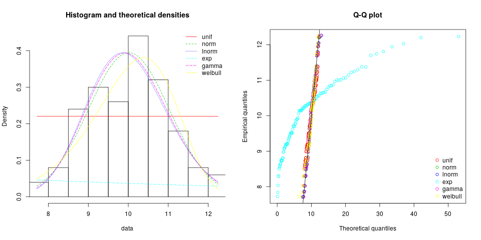

# fit_dist
Simple R script to fit distributions to data. This script is intended to provides students with a simple way to fit distributions (e.g., for input analysis in a simulation course).


This work is licensed under the
[Creative Commons Attribution 4.0 International License](http://creativecommons.org/licenses/by/4.0/). For questions please contact
[Michael Hahsler](http://michael.hahsler.net).


## Required Installation 

* Install [R](https://cran.r-project.org/) 
* Optional: Install [R Studio](https://rstudio.com/products/rstudio/download/)
* Download the script: `source('https://raw.githubusercontent.com/mhahsler/fit_dist/master/fit_dist.R')`. 

## Usage

```
fit_dist(x, distributions = NULL, discrete = NULL, 
  plot = TRUE, ...)
```
where `x` is a vector with the data, `distributions` is a vector with the distributions to fit,
`discrete` indicates if discrete or continuous distributions should be fit, and
`plot` indicates if a Q-Q plot should be displayed. The function displays the results of statistical tests and function returns a list with the estimated parameters.

_Note:_ The plot might be to large for the little window in R Studio. Use `X11()` (`quarz()` for Macs) to open a bigger window for plotting.


## Examples

Download the script first.
```
source('https://raw.githubusercontent.com/mhahsler/fit_dist/master/fit_dist.R')
```

Fit some random data with a normal distribution.
```
x <- rnorm(100, mean = 10, sd = 1)
fit <- fit_dist(x)
```



```
fit_dist helper (see: https://github.com/mhahsler/fit_dist)

Trying to fit unif, norm, lnorm, exp, gamma, beta, weibull 
Fitting: unif 
Fitting: norm 
Fitting: lnorm 
Fitting: exp 
Fitting: gamma 
Fitting: beta 
Error in computing default starting values.
Error in manageparam(start.arg = start, fix.arg = fix.arg, obs = data,  : 
  Error in start.arg.default(obs, distname) : 
  values must be in [0-1] to fit a beta distribution

Fitting: weibull 
Test results:
        Kolmogorov.iSmirnov.test Cramer.von.Mises.test Anderson.Darling.test Chi.Square.p.value
unif                not rejected          not computed          not computed       1.677783e-02
norm                not rejected          not computed          not computed       7.435807e-01
lnorm               not rejected          not computed          not computed       5.362755e-01
exp                     rejected              rejected              rejected      2.148867e-127
gamma               not rejected          not rejected          not rejected       6.183843e-01
weibull             not rejected          not rejected          not rejected       7.797596e-01

*** Best fit using the AIC is: norm ***
*** Best fit using the BIC is: norm ***
```

```
fit
```

```
$unif
Fitting of the distribution ' unif ' by maximum likelihood 
Parameters:
     estimate Std. Error
min  7.570601         NA
max 12.224757         NA

$norm
Fitting of the distribution ' norm ' by maximum likelihood 
Parameters:
     estimate Std. Error
mean 9.986087 0.09884770
sd   0.988477 0.06989556

$lnorm
Fitting of the distribution ' lnorm ' by maximum likelihood 
Parameters:
         estimate  Std. Error
meanlog 2.2962177 0.010021790
sdlog   0.1002179 0.007083301

$exp
Fitting of the distribution ' exp ' by maximum likelihood 
Parameters:
      estimate Std. Error
rate 0.1001393 0.01001293

$gamma
Fitting of the distribution ' gamma ' by maximum likelihood 
Parameters:
       estimate Std. Error
shape 100.68077   14.21488
rate   10.08203    1.42700

$weibull
Fitting of the distribution ' weibull ' by maximum likelihood 
Parameters:
      estimate Std. Error
shape 11.16064 0.84788207
scale 10.43341 0.09891693

attr(,"gof")
Goodness-of-fit statistics
                                  unif       norm      lnorm        exp      gamma    weibull
Kolmogorov-Smirnov statistic 0.1675067 0.06388482 0.08325544  0.5419494 0.07685832 0.06338501
Cramer-von Mises statistic   0.7575686 0.05303841 0.07260888  8.0778787 0.06344904 0.08042399
Anderson-Darling statistic         Inf 0.34161070 0.44366264 37.3407902 0.39257035 0.57981244

Goodness-of-fit criteria
                               unif     norm    lnorm      exp    gamma  weibull
Akaike's Information Criterion   NA 285.4697 286.9495 662.2386 286.1829 289.6857
Bayesian Information Criterion   NA 290.6801 292.1599 664.8437 291.3932 294.8961
```

__Note:__ Look for the closest match in the Q-Q plot and the smallest numbers in Goodness-of-fit statistics and criteria. You can look up the different [goodness-of-fit statistics on Wikipedia](https://en.wikipedia.org/wiki/Goodness_of_fit). It is often also helpful to look at the
[relationship between distributions](https://en.wikipedia.org/wiki/Relationships_among_probability_distributions) when choosing a fitted distribution.   


### Fit a specific distribution
```
x <- rexp(100))
fit_dist(x, distributions = "exp")
```

### The helper recognizes data for discrete distributions 
```
x <- rpois(100, lambda = 2)
fit_dist(x)

fit_dist helper (see: https://github.com/mhahsler/fit_dist)

Trying to fit binom, pois, nbinom, geom, hyper 
...
```

To avoid this behavior and fit continuous distributions, use `discrete = FALSE`.

### Fit your own data
You can use your own data by reading in CVS files in R Studio via `_Environment Tab>Import Datasets_` (window to the right) or you can type `my_data <- read.csv("my_data.csv")`. You can then use the appropriate column (here `x`) to fit the distribution using `fit_dist(my_data$x)`.